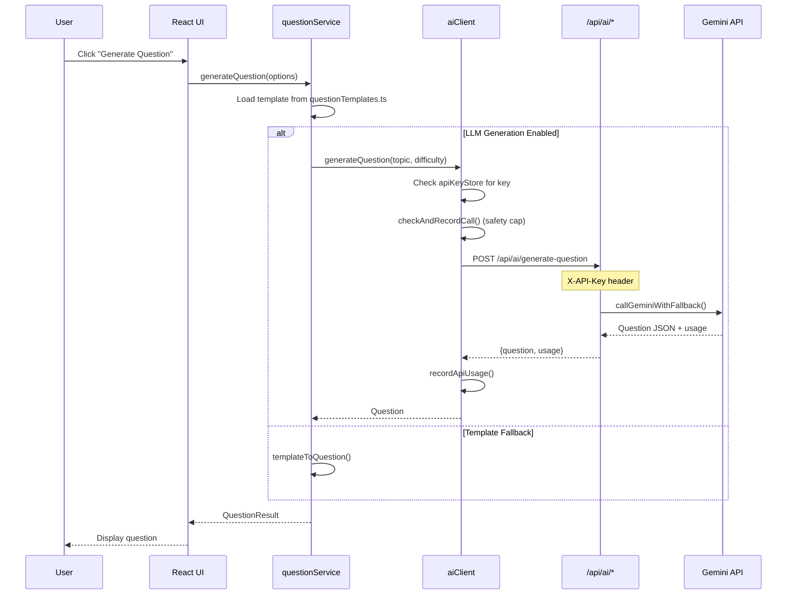
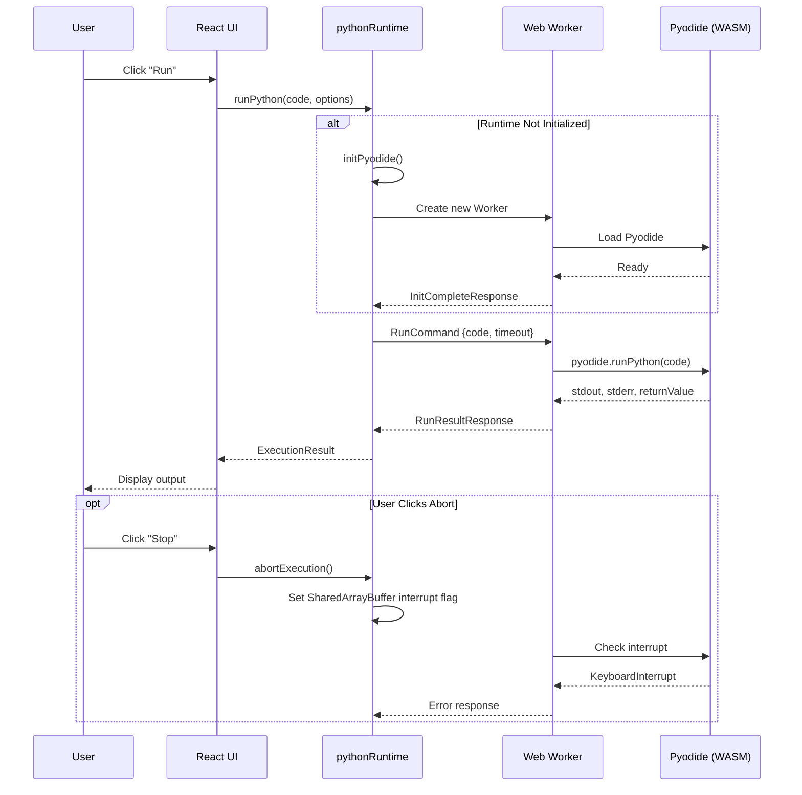
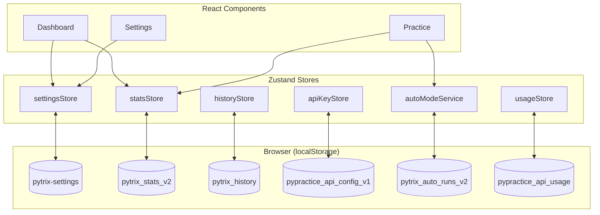

# Pytrix Architecture

A comprehensive guide to Pytrix's system design, data flow, and technical decisions.

---

## High-Level Overview

Pytrix is a client-heavy web application where most logic runs in the browser. The server (Next.js API routes) acts primarily as a secure proxy for Gemini API calls.

```
┌─────────────────────────────────────────────────────────────────────────────┐
│                              BROWSER (Client)                                │
├─────────────────────────────────────────────────────────────────────────────┤
│                                                                              │
│  ┌──────────────┐     ┌──────────────┐     ┌──────────────┐                 │
│  │   React UI   │────▶│   Zustand    │────▶│  localStorage │                │
│  │  Components  │     │   Stores     │     │  Persistence  │                │
│  └──────────────┘     └──────────────┘     └──────────────┘                 │
│         │                    │                                               │
│         │                    │                                               │
│         ▼                    ▼                                               │
│  ┌──────────────┐     ┌──────────────┐                                      │
│  │  AI Client   │     │   Python     │                                      │
│  │  (aiClient)  │     │   Runtime    │                                      │
│  └──────────────┘     └──────────────┘                                      │
│         │                    │                                               │
│         │                    ▼                                               │
│         │             ┌──────────────┐                                      │
│         │             │  Web Worker  │◀──── SharedArrayBuffer (interrupts)  │
│         │             │   (Pyodide)  │                                      │
│         │             └──────────────┘                                      │
│         │                                                                    │
└─────────│────────────────────────────────────────────────────────────────────┘
          │
          ▼
┌─────────────────────────────────────────────────────────────────────────────┐
│                           SERVER (Next.js API Routes)                        │
├─────────────────────────────────────────────────────────────────────────────┤
│                                                                              │
│  ┌─────────────────────────────────────────────────────────┐                │
│  │                    /api/ai/*                            │                │
│  │                                                         │                │
│  │   1. Extract X-API-Key from request header              │                │
│  │   2. Validate request body                              │                │
│  │   3. Call modelRouter with user's API key               │                │
│  │   4. Return result + usage metadata                     │                │
│  │                                                         │                │
│  └─────────────────────────────────────────────────────────┘                │
│                              │                                               │
└──────────────────────────────│───────────────────────────────────────────────┘
                               │
                               ▼
                    ┌──────────────────────┐
                    │   Google Gemini API  │
                    │   (External Service) │
                    └──────────────────────┘
```

---

## Core Features & Routes

| Feature                   | Route                 | Description                                       |
| ------------------------- | --------------------- | ------------------------------------------------- |
| **Dashboard**             | `/`                   | Module stats, recent activity, quick navigation   |
| **Curriculum Browser**    | `/modules`            | Browse modules, subtopics, and problem archetypes |
| **Manual Practice Setup** | `/practice/manual`    | Configure specific topic/difficulty               |
| **Auto Mode Setup**       | `/practice/auto`      | Start or resume adaptive runs                     |
| **Practice Workspace**    | `/practice`           | Code editor, runner, test cases                   |
| **History**               | `/history`            | Past practice sessions                            |
| **API Usage**             | `/insights/api-usage` | Token usage tracking                              |
| **Settings**              | `/support/settings`   | BYOK, preferences                                 |
| **Help**                  | `/support/help`       | Documentation                                     |

---

## Data Flow Diagrams

### Question Generation & Evaluation Flow



### Python Execution Flow



### State Management Architecture



---

## Core Services

### `lib/ai/` — AI Integration

| File              | Purpose                                                            |
| ----------------- | ------------------------------------------------------------------ |
| `aiClient.ts`     | **Primary client-side API wrapper**. All AI calls go through here. |
| `geminiClient.ts` | Low-level Gemini SDK wrapper                                       |
| `modelRouter.ts`  | Model fallback logic and rate limit handling                       |

**Key Design Decisions:**

- API key passed via `X-API-Key` header (never stored server-side)
- Usage recorded after each successful call
- Normalized error types for consistent handling

### `lib/runtime/` — Python Execution

| File               | Purpose                        |
| ------------------ | ------------------------------ |
| `pythonRuntime.ts` | Main runtime orchestrator      |
| `pythonWorker.ts`  | Web Worker implementation      |
| `testRunner.ts`    | Test case execution logic      |
| `runtimeConfig.ts` | Configuration and status types |

**Key Design Decisions:**

- Web Worker for non-blocking execution
- SharedArrayBuffer for true interrupt capability
- Singleton pattern for runtime instance

### `lib/question/` — Question Generation

| File                     | Purpose                              |
| ------------------------ | ------------------------------------ |
| `questionService.ts`     | Main generation orchestrator         |
| `questionTemplates.ts`   | Template definitions by problem type |
| `diversityService.ts`    | Prevents duplicate/similar questions |
| `questionFingerprint.ts` | Fingerprinting for deduplication     |
| `archetypeRegistry.ts`   | Problem archetype definitions        |

**Key Design Decisions:**

- Two-layer generation: templates first, LLM enhancement optional
- Diversity tracking to avoid repetition
- Validation and normalization of all questions

### `lib/stores/` — State Management

| File               | Purpose                          |
| ------------------ | -------------------------------- |
| `settingsStore.ts` | App settings (Zustand + persist) |
| `statsStore.ts`    | Practice statistics              |
| `historyStore.ts`  | Practice session history         |
| `topicsStore.ts`   | Topic/module data access         |
| `apiKeyStore.ts`   | API key storage                  |
| `usageStore.ts`    | API usage tracking               |

**Key Design Decisions:**

- Zustand for lightweight, hook-based state
- localStorage persistence via Zustand middleware
- Hierarchical stats: Module → Subtopic → ProblemType

### `lib/auto-mode/` — Adaptive Practice

| File                 | Purpose                        |
| -------------------- | ------------------------------ |
| `autoModeService.ts` | Run management and queue logic |
| `autoRunTypes.ts`    | Type definitions               |

**Key Design Decisions:**

- Mini-curriculum for new users (String Manipulation focus)
- Streak-based difficulty progression
- Remediation injection on failures
- 24-hour decay for stale streaks

---

## API Routes

All AI-related API routes follow the same pattern:

### Request Format

```http
POST /api/ai/{endpoint}
Content-Type: application/json
X-API-Key: {user's Gemini API key}

{
  // Endpoint-specific body
}
```

### Response Format

```json
{
  "data": {
    /* endpoint-specific response */
  },
  "usage": {
    "model": "gemini-1.5-flash",
    "inputTokens": 150,
    "outputTokens": 500
  }
}
```

### Available Endpoints

| Endpoint                    | Body                                | Response                     |
| --------------------------- | ----------------------------------- | ---------------------------- |
| `/api/ai/generate-question` | `{topic, difficulty}`               | `{question, usage}`          |
| `/api/ai/get-hints`         | `{question, code, hintsCount}`      | `{hint, usage}`              |
| `/api/ai/reveal-solution`   | `{question, failedAttempts}`        | `{referenceSolution, usage}` |
| `/api/ai/evaluate-code`     | `{question, code, output?, error?}` | `{evaluation, usage}`        |
| `/api/ai/optimize-solution` | `{question, userCode}`              | `{optimized, usage}`         |
| `/api/ai/test-connection`   | (none)                              | `{valid, error?}`            |

---

## Security Architecture

### SharedArrayBuffer Requirements

Pytrix uses SharedArrayBuffer for Python execution interruption. This requires:

```typescript
// next.config.ts
headers: [
  { key: "Cross-Origin-Opener-Policy", value: "same-origin" },
  { key: "Cross-Origin-Embedder-Policy", value: "require-corp" },
];
```

### API Key Security

```
┌─────────────────────────────────────────────────────────────┐
│                        Browser                               │
│                                                              │
│  ┌──────────────┐     ┌──────────────┐                      │
│  │ localStorage │────▶│  aiClient    │                      │
│  │ (API key)    │     │              │                      │
│  └──────────────┘     └──────────────┘                      │
│                              │                               │
│                              │ X-API-Key header              │
│                              ▼                               │
│  ┌──────────────────────────────────────────────────────┐   │
│  │          Same-Origin API Routes (/api/ai/*)          │   │
│  │          Key used immediately, never stored          │   │
│  └──────────────────────────────────────────────────────┘   │
│                              │                               │
└──────────────────────────────│───────────────────────────────┘
                               │ HTTPS
                               ▼
                    ┌──────────────────────┐
                    │   Google Gemini API  │
                    └──────────────────────┘
```

---

## Data Schema

### Topics Hierarchy

```
TopicsData
├── version: "1.0.0"
├── generatedAt: ISO timestamp
└── modules: Module[]
    ├── id: "string-manipulation"
    ├── name: "String Manipulation"
    ├── order: 1
    ├── overview: "Strings are immutable..."
    ├── pythonConsiderations: string[]
    ├── subtopics: Subtopic[]
    │   ├── id: "basic-string-operations"
    │   ├── name: "Basic String Operations"
    │   ├── sectionNumber: "1.1"
    │   └── problemTypes: ProblemType[]
    │       ├── id: "indexing-and-slicing"
    │       ├── name: "Indexing & Slicing"
    │       └── description: "s[i], s[start:end]..."
    └── problemArchetypes: string[]
```

### Stats Hierarchy

```
GlobalStatsV2
├── version: 3
├── totalAttempts: number
├── totalSolved: number
├── totalTimeTakenMs: number
├── modulesTouched: number
├── subtopicsTouched: number
├── masteryPercent: number
├── currentManualStreak: number
├── lastUpdatedAt: timestamp
└── modules: ModuleStats[]
    ├── moduleId, moduleName
    ├── attempts, solved, masteryPercent
    └── subtopics: SubtopicStats[]
        ├── subtopicId, subtopicName
        ├── attempts, solved, masteryPercent
        └── problemTypes: ProblemTypeStats[]
            ├── problemTypeId, problemTypeName
            ├── attempts, solved (aggregated)
            └── beginner/intermediate/advanced: DifficultyStats
                ├── attempts, solved
                ├── avgTimeTakenMs
                └── lastAttemptAt
```

---

## Component Architecture

### Layout Hierarchy

```
RootLayout
└── GlobalProviders (ApiKeyContext, ThemeProvider)
    └── AppShell
        ├── AppSidebar (navigation)
        └── Main Content
            ├── Dashboard (/)
            ├── ModulesPage (/modules)
            ├── PracticeWorkspace (/practice)
            │   ├── PracticeHeader
            │   ├── ResizablePanels
            │   │   ├── QuestionPanel
            │   │   ├── CodeEditorPanel
            │   │   └── OutputPanel
            │   ├── BottomActionBar
            │   └── RuntimeStatusBar
            └── SettingsPage (/support/settings)
```

### Practice Workspace Components

| Component          | Purpose                                   |
| ------------------ | ----------------------------------------- |
| `PracticeHeader`   | Title, topic breadcrumb, difficulty badge |
| `QuestionPanel`    | Problem description, hints, test cases    |
| `CodeEditorPanel`  | Monaco editor with Python syntax          |
| `OutputPanel`      | Execution results, test case status       |
| `BottomActionBar`  | Run, Submit, Get Hint, Reveal buttons     |
| `RuntimeStatusBar` | Pyodide status, Python version, timing    |

---

## Design Decisions & Rationale

### Why BYOK (Bring Your Own Key)?

1. **Privacy**: Users control their own API usage
2. **No Backend Costs**: We don't need to manage API quotas
3. **Transparency**: Users see exactly what they're paying for
4. **Trust**: No secrets pass through our infrastructure

### Why Pyodide (WebAssembly Python)?

1. **Instant Execution**: No network round-trip
2. **Privacy**: Code never leaves the browser
3. **Reliability**: No server capacity limits
4. **Interruption**: True abort capability via SharedArrayBuffer

### Why Zustand for State?

1. **Simplicity**: Minimal boilerplate vs Redux
2. **Performance**: No context provider re-renders
3. **Persistence**: Built-in localStorage middleware
4. **TypeScript**: Excellent type inference

### Why Two-Layer Question Generation?

1. **Speed**: Templates provide instant fallback
2. **Reliability**: Works without API key
3. **Quality**: LLM adds variation when available
4. **Diversity**: Fingerprinting prevents repetition

---

## Extension Points

### Adding a New Module

1. Edit `src/data/topics.json`
2. Add module entry following existing schema
3. Restart dev server (JSON is loaded at build time)

### Adding a New AI Endpoint

1. Create route at `src/app/api/ai/{endpoint}/route.ts`
2. Add client function in `src/lib/ai/aiClient.ts`
3. Follow existing patterns for error handling and usage tracking

### Adding a New Store

1. Create store in `src/lib/stores/{name}Store.ts`
2. Use Zustand's `persist` middleware for localStorage
3. Export from `src/lib/stores/index.ts`

For detailed API documentation, see [API Reference](./api-reference.md).
